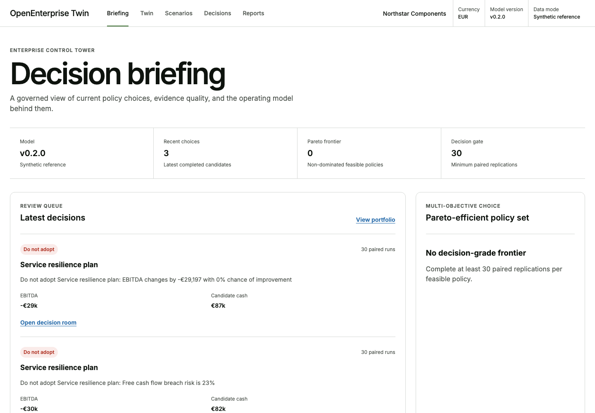
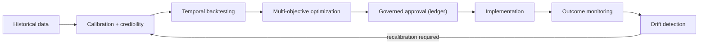
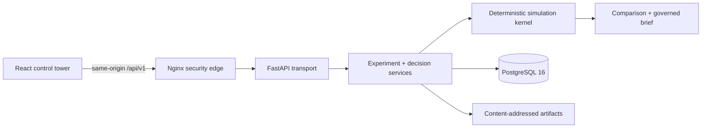

<div align="center">

# OpenEnterprise Twin

**A governed Monte Carlo decision twin for commercial, operational and liquidity policy.**

[](https://github.com/mfidalgomartins/OpenEnterprise-Twin/actions/workflows/ci.yml)
[](backend/pyproject.toml)
[](frontend/package.json)
[](docker-compose.yml)
[](LICENSE)

[Run the flagship demo](#run-it-locally) · [Inspect the decision model](docs/model.md) · [Explore the architecture](docs/architecture.md) · [Read the threat model](docs/OpenEnterprise-Twin-threat-model.md)

</div>

> **Policy → paired simulation → evidence gate → Pareto frontier → immutable executive brief.**



## The product

OpenEnterprise Twin models a company as one connected operating and financial system. A policy can change pricing, commercial investment, finite capacity, sourcing, safety stock, payment terms or capital deployment. The twin then runs baseline and candidate against the same stochastic shock tapes and evaluates value, service and liquidity together.

The result is not another KPI dashboard. It is a governed decision workspace with:

- an explicit `adopt`, `pilot only` or `do not adopt` recommendation;
- a 30-paired-run evidence gate that prevents exploratory output from authorizing adoption;
- Student-t intervals for paired effects and Wilson intervals for breach risk;
- hard-constraint precedence for liquidity and operational guardrails;
- a multi-objective Pareto frontier across EBITDA, free cash flow and OTIF;
- named owners, review dates, actions and content-addressed evidence digests;
- an eight-chapter, print-safe executive decision brief.

Northstar Components is the included synthetic B2B manufacturing reference model. It exists to make the whole system executable without implying that its parameters are calibrated to a real company.

## Why it is unusual

| Typical analytics product | OpenEnterprise Twin |
| --- | --- |
| Reports correlated KPIs | Simulates one reconciled operational-financial ledger |
| Compares independent averages | Uses paired common-random-number experiments |
| Hides sample quality | Enforces and displays an evidence gate |
| Optimizes one objective | Exposes feasible non-dominated policies |
| Generates a recommendation | Proves every recommendation against typed evidence |
| Treats provenance as metadata | Makes provenance part of the immutable result |

## v0.3 — the Governed Decision Autopilot

v0.3 turns the twin from a scenario simulator into an **operational decision system** that closes the loop: it learns the twin from history, discovers optimal policy, governs the decision, watches the real outcome, and detects when it must recalibrate.



- **Calibration Studio** — ingest reproducible operating history as JSON or a validated long-format CSV, profile its quality, estimate parameters and dominant seasonality separating *observed / estimated / assumed* provenance with confidence intervals, backtest out-of-sample, and score a transparent, decomposable **Credibility Score** (0–100). Datasets export to formula-neutralised CSV. Northstar reaches ~92 (decision-grade) at a realistic ~0.11 out-of-sample wMAPE.
- **Optimization Lab** — a deterministic, constrained **NSGA-II** search over the engine surfaces the Pareto frontier of EBITDA and service level under hard and soft constraints, with robustness, lever sensitivity and convergence evidence.
- **Adaptive Policy Builder** — a safe declarative DSL (allow-listed metrics/operators/actions, no code execution, contradiction detection) whose conditional rules respond to backlog, OTIF, demand and liquidity, compared against the static plan on identical shock tapes.
- **Decision Ledger** — an append-only, versioned decision state machine with optimistic concurrency, separation of duties, evidence immutability after review, and tamper-evident decision packets.
- **Monitoring Center** — expected-vs-realised reconciliation per KPI, cumulative deviation, hard-constraint compliance, decomposed data/parameter/result drift, and a governed alert ladder with cooldown and deduplication.

Run the whole loop end to end (after `make dev`):

```bash
make demo-autopilot
```

It ingests synthetic Northstar history, calibrates and scores credibility, runs the optimizer, governs a decision to approval, records outcomes and prints the monitoring verdict — every step content-addressed. Explore it in the UI under **Calibration → Optimization → Adaptive → Ledger → Monitoring**.

[Closed-loop analytics and API →](docs/architecture.md)

## Run it locally

Prerequisites: Docker with Compose, Python 3.12, Node.js 22+ and Make.

```bash
cp .env.example .env
# Replace the example PostgreSQL password in both values in .env.
make dev
```

In a second terminal:

```bash
make demo
```

The demo seeds Northstar, creates the **Service resilience plan**, executes a paired baseline/candidate experiment and prints a Decision Room URL with the seed, model versions, assumption hashes and evidence digests.

Release gates:

```bash
make lint
make test
make build
make e2e
make docker-build
```

## Architecture at a glance



The Python backend is a modular monolith. Import contracts keep the domain, simulation and plugin SDK independent of delivery infrastructure. A bounded runner owns asynchronous experiment lifecycle; PostgreSQL stores lifecycle and compact evidence; detailed traces are canonical gzip JSON artifacts.

[Architecture and API contracts →](docs/architecture.md)

## Model credibility

- Daily integer-cent/minute/unit ledger with warm-up, evaluation and runoff cohorts.
- Demand, backlog, finite-capacity production, materials, scrap, receivables, payables, debt and cash evolve in one transition.
- Explicit economic cost for commercial investment, committed capacity, supplier terms and production scrap.
- Evaluation-origin cash flows continue through runoff; residual receivables and payables are included in free cash flow.
- Counter-keyed NumPy Philox shock tapes are stable by seed, replication, process, day, entity and draw ID.
- Physical and accounting invariants reconcile every period; artifact, tape, comparison and brief digests are validated on read.

[Equations, units, assumptions and invariants →](docs/model.md)

## Security posture

Production mode requires an API key, disables interactive API documentation, validates host headers, limits request bodies and caps simulation work. The supplied Nginx edge keeps the key server-side, applies a strict content security policy and proxies browser requests same-origin. PostgreSQL binds to loopback in the local Compose profile and requires an operator-supplied password.

This is a single-tenant reference release, not a multi-tenant identity platform. OIDC/RBAC, distributed workers and an object-store artifact adapter remain deployment extensions.

[Trust boundaries, abuse cases and mitigations →](docs/OpenEnterprise-Twin-threat-model.md)

## Repository map

```text
backend/
  src/openenterprise_twin/
    domain/          immutable company, scenario, result and ledger contracts
    simulation/      shock tapes, daily engine, metrics and invariants
    analytics/       calibration, backtesting, credibility, optimization,
                     adaptive policies and outcome monitoring (pure layer)
    scenarios/       paired comparison and materiality policy
    reporting/       evidence-linked recommendation and executive brief
    application/     experiment, decision-loop and ledger services (ports only)
    infrastructure/  SQLAlchemy, artifacts, settings and bounded runner
    api/             FastAPI resources, security and problem details
frontend/
  src/features/
    control/         briefing, twin, portfolio, frontier and brief register
    scenarios/       policy studio and decision room
    autopilot/       calibration, optimization, adaptive, ledger, monitoring
    reports/         immutable executive brief
docs/                architecture, model, design, security and contribution guides
```

## Current boundaries

- The reference parameters are engineering assumptions, not causal estimates or forecasts.
- Execution is bounded and in-process; horizontal failover needs a durable queue adapter.
- Filesystem artifacts are single-node unless backed by shared durable storage.
- API-key authentication is suitable for a controlled single-tenant deployment; enterprise identity needs OIDC and roles.
- PostgreSQL is the supported non-test relational store; SQLite is only an isolated test/demo adapter.

## Contributing

Focused contributions are welcome. Model changes must state equations, units, rounding, stochastic keys and version impact, and must preserve deterministic replay and ledger invariants.

[Contribution workflow →](docs/contributing.md) · [Design system →](docs/design-system.md)

## License

Apache License 2.0. See [LICENSE](LICENSE).
