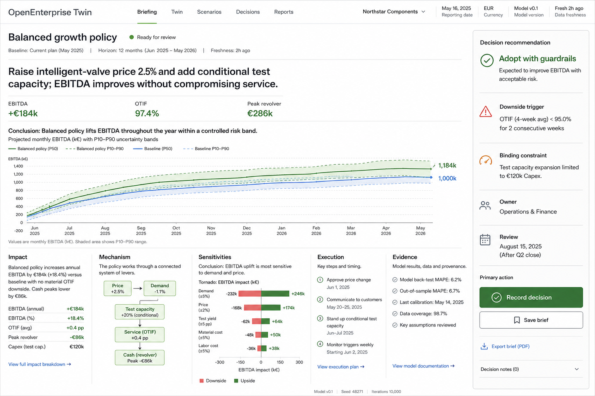
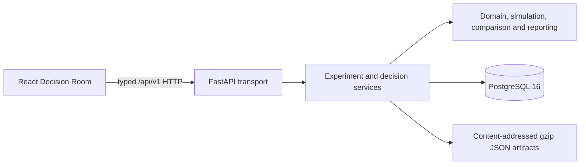

# OpenEnterprise Twin

## Product thesis

OpenEnterprise Twin treats a company as one connected operating system, not a collection of dashboards. Change a commercial, capacity, supply or working-capital policy; run the same company through baseline and candidate conditions; then inspect the distribution of value, service and liquidity outcomes together.

The 0.1 reference company, **Northstar Components**, is a synthetic mid-market B2B manufacturer. Its Decision Room produces an evidence-linked recommendation with explicit trade-offs, downside triggers and a complete reproducibility record. It is a decision simulator, not a forecast oracle: every conclusion is conditional on the model and assumptions shown with it.

## Decision Room visual



The interface is an interactive executive brief: conclusion first, uncertainty in view, operating mechanism beneath it and provenance at the point of decision. The accepted concept is the visual source of truth for the scenario comparison experience.

## Five-minute demo

Prerequisites: Docker with Compose, Python 3.12, Node.js 22+ and Make.

```bash
cp .env.example .env
make dev
```

`make dev` creates the local Python environment, installs locked frontend packages, starts PostgreSQL 16, applies Alembic migrations, seeds the Northstar baseline, and serves the API and frontend. Keep it running, then use a second terminal:

```bash
make demo
```

The demo creates the **Service resilience plan**, runs baseline and candidate with common random numbers, materializes the comparison and executive brief, and prints the Decision Room route plus seed, replication count, model versions, resolved-assumption hashes and evidence digests. Defaults are `DEMO_SEED=731` and `DEMO_REPLICATIONS=100`; override either through `.env` or the command line.

Useful checks:

```bash
make lint
make test
make build
make e2e
make docker-build
```

## Why it is different

- **Decisions before metrics.** The output is a policy recommendation, mechanism and guardrail set—not a KPI wall.
- **One operational-financial ledger.** Demand, backlog, production, material, service, receivables, payables, debt and cash move in one daily transition.
- **Uncertainty is structural.** Every reported metric includes distributions and breach probabilities; comparisons use paired replications rather than independent averages.
- **Reproducibility is part of the result.** Company version, scenario schema, engine, stochastic tape, plugins, seed, replication count, assumptions and content digests travel with the evidence.
- **Publication is immutable.** Every Decision Room opens a versioned, eight-chapter executive brief with named actions and a print-safe A4 PDF path.
- **Extension without infrastructure leakage.** Typed plugin contracts accept immutable domain values and never receive FastAPI or SQLAlchemy objects.

## Architecture



The backend is a modular Python monolith: immutable domain models and the simulation kernel are infrastructure-free; application services own experiment lifecycle and decision assembly; infrastructure implements PostgreSQL and artifact persistence; FastAPI exposes versioned resources. Experiments run in a bounded in-process executor whose interface can later be replaced by a queue without changing HTTP contracts.

See [architecture.md](docs/architecture.md) for module boundaries, runtime flow, persistence and deployment details.

## Model credibility

- Daily integer-ledger simulation from a fixed start date, with a 91-day warm-up, 364-day evaluation and 60-day runoff in the standard run.
- Counter-keyed NumPy Philox draws built outside business transitions; no global random state.
- Common random numbers align baseline and candidate by seed, replication, process, day, entity and draw identifier.
- Every period validates finished-goods, work-in-progress, material and backlog conservation; capacity bounds; order outcomes; and cash and debt reconciliation to the cent.
- Experiment summaries retain replication-level values and reconcile every distribution back to them.
- Executive prose is deterministic and can cite only computed metric evidence.

The equations, units, stochastic distributions, metric semantics and invariant codes are documented in [model.md](docs/model.md).

## Extension model

The plugin SDK defines six typed capability protocols: `DemandModel`, `OperationsModel`, `FinanceModel`, `RiskMetric`, `OptimizationStrategy` and `ReportSection`. Each plugin declares a semantic version, inclusive engine compatibility range, configuration schema and unique capability IDs. The registry rejects incompatible versions, duplicate IDs and implementations that do not satisfy the declared typed contract.

Registration is explicit and in-process in 0.1. Python entry-point discovery and stronger third-party isolation are roadmap items; plugins are not arbitrary code uploaded through the API.

## Roadmap

**0.2 — Optimization Workbench:** bounded candidate screening, risk-adjusted optimization, sensitivity and driver decomposition, and entry-point plugin discovery.

**0.3 — Enterprise Extension:** OR-Tools sourcing/capacity adapter, durable workers, OIDC and roles, S3-compatible artifacts, company-model import diagnostics and scenario approvals.

**1.0 — Trusted Decision Platform:** stable plugin SDK, calibration and backtesting workbenches, portfolio allocation, event-driven state updates, benchmark datasets and a long-term support policy.

## Limitations

- Northstar is synthetic and its stochastic parameters are engineering assumptions, not estimates calibrated to a real company.
- Results are conditional simulations and do not establish causal effects or guarantee future outcomes.
- The 0.1 runtime has no ERP/CRM connectors, multi-tenancy, authentication, billing or real-time ingestion.
- Experiment execution is in-process and intended for bounded local or single-instance workloads.
- PostgreSQL is the production relational store; SQLite exists only as an isolated test adapter.
- Full traces use local filesystem artifacts; distributed deployments need a shared artifact-store adapter.
- Python dependencies currently use bounded ranges rather than a committed backend lockfile. Frontend CI uses `npm ci` and `package-lock.json`.
- The frontend container expects a same-network API upstream and defaults to `http://api:8000`; override `API_UPSTREAM` when deploying under a different service name.

## Contributing

Start with [contributing.md](docs/contributing.md). Changes must preserve deterministic replay, module boundaries and ledger invariants; model changes require tests and a version decision. Run `make lint`, `make test` and `make build` before opening a pull request. Do not commit generated wheels, frontend bundles, simulation artifacts, test reports, caches or local environment files.

## Licence

Licensed under the [Apache License 2.0](LICENSE).
