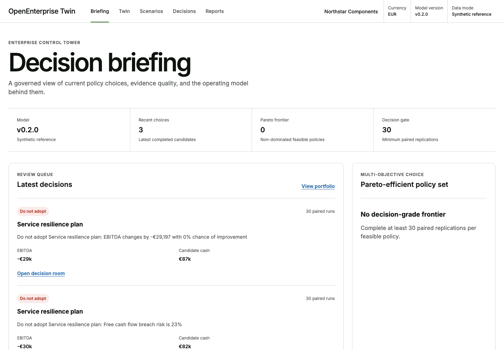
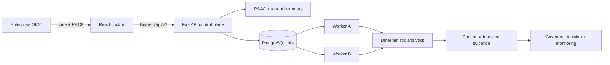
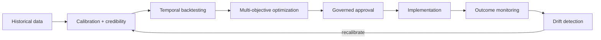

<div align="center">

# OpenEnterprise Twin

**An open decision operating system for testing enterprise policy before it
changes operations, cash or customer service.**

[](https://github.com/mfidalgomartins/OpenEnterprise-Twin/actions/workflows/ci.yml)
[](https://github.com/mfidalgomartins/OpenEnterprise-Twin/actions/workflows/security.yml)
[](CHANGELOG.md)
[](backend/pyproject.toml)
[](frontend/package.json)
[](docker-compose.yml)
[](LICENSE)

[Run the decision demo](#run-it) ·
[Evaluate the architecture](docs/architecture.md) ·
[Configure enterprise identity](docs/identity-and-access.md) ·
[Operate durable jobs](docs/jobs.md) ·
[Review the threat model](docs/OpenEnterprise-Twin-threat-model.md)

</div>

> **Policy → paired simulation → evidence gate → governed approval → monitored
> outcome.**



## The decision it helps you make

What happens to EBITDA, free cash flow, liquidity and OTIF if the business
changes pricing, commercial investment, capacity, sourcing, safety stock,
payment terms or capital deployment?

OpenEnterprise Twin models those policies inside one reconciled
operational-financial system. Baseline and candidate run against the same
stochastic shock tapes, so the result isolates policy effect instead of hiding
it inside unrelated noise.

The output is not just a dashboard:

- an explicit **adopt**, **pilot only** or **do not adopt** recommendation;
- paired effect intervals and breach-risk intervals;
- hard liquidity and operating guardrails;
- a feasible multi-objective Pareto frontier;
- named owners, review dates and governed transitions;
- immutable evidence digests and an eight-chapter executive brief;
- outcome monitoring and recalibration signals after implementation.

Northstar Components is the included synthetic B2B manufacturing model. It
makes the complete loop executable without representing a calibrated forecast
for a real company.

## Why it is different

| Typical analytics product | OpenEnterprise Twin |
| --- | --- |
| Reports correlated KPIs | Simulates one reconciled operations-and-cash ledger |
| Compares independent averages | Uses paired common-random-number experiments |
| Hides sample quality | Enforces a visible evidence gate |
| Optimizes one objective | Exposes feasible non-dominated policies |
| Generates prose first | Links every recommendation to typed evidence |
| Treats provenance as metadata | Makes provenance part of the immutable result |
| Runs expensive work inside requests | Returns durable, cancellable, recoverable jobs |
| Uses UI roles as protection | Enforces identity, RBAC and tenant ownership server-side |

## v0.6 — identity, tenancy and durable execution

v0.6 moves the project from a secure single-tenant baseline to an
identity-aware, tenant-isolated decision platform.


```mermaid
flowchart LR
    IDP["Enterprise OIDC"] -->|"code + PKCE"| WEB["React cockpit"]
    WEB -->|"Bearer /api/v1"| API["FastAPI control plane"]
    API --> AUTH["RBAC + tenant boundary"]
    API --> JOBS[("PostgreSQL jobs")]
    JOBS --> W1["Worker A"]
    JOBS --> W2["Worker B"]
    W1 --> CORE["Deterministic analytics"]
    W2 --> CORE
    CORE --> ART["Content-addressed evidence"]
    ART --> GOV["Governed decision + monitoring"]
```

- **Enterprise identity** — OIDC signature, issuer, audience, lifetime,
  algorithm and JWKS validation; authorization code + PKCE in the browser;
  API-key mode retained only for explicit tenant-bound service accounts.
- **Role policy** — `viewer`, `analyst`, `approver` and `admin`, enforced at
  API boundaries with authenticated separation of duties.
- **Tenant isolation** — mandatory tenant ownership, repository filtering,
  composite uniqueness and same-tenant foreign keys across business data.
- **Durable jobs** — one lifecycle for experiment, calibration, optimization
  and adaptive comparison with idempotent submission, attempts, progress,
  heartbeat, cancellation, leases, retry and restart recovery.
- **Operator-grade proof** — PostgreSQL concurrency/isolation tests, ephemeral
  OIDC and JWKS rotation, live browser login, locked dependency audits, CodeQL,
  container builds and an enforced JavaScript bundle budget.

[See exactly how identity is enforced →](docs/identity-and-access.md) ·
[Inspect leases, recovery and cancellation →](docs/jobs.md)

## Capability proof

| Capability | Runtime proof | Automated gate |
| --- | --- | --- |
| Deterministic policy simulation | Versioned Philox shock tapes and reconciled ledger | Replay, invariant and digest tests |
| Evidence-quality decisions | Paired Student-t effects, Wilson breach intervals and adoption gate | Analytical and report contract tests |
| OIDC and RBAC | Effective `/api/v1/session` and route-level security dependencies | JWT rejection matrix, JWKS rotation and browser PKCE |
| Tenant isolation | Tenant-required repositories and tenant-aware database constraints | SQLite matrix plus PostgreSQL cross-tenant suite |
| Durable analytical execution | SQL jobs, leases, heartbeat, cancellation and idempotent handlers | Two-worker claim, stale lease and restart tests |
| Governed approval | Append-only ledger and identity-bound separation of duties | Role/transition authorization matrix |
| Supply-chain baseline | Hash-pinned Python locks and npm lockfile | `pip-audit`, `npm audit` and CodeQL |

Implemented capability is documented separately from future adapters. S3
artifacts and enterprise data connectors remain on the roadmap rather than
being presented as shipped.

## Run it

Prerequisites: Docker with Compose, Python 3.12, Node.js 22+ and Make.

```bash
cp .env.example .env
# Replace the PostgreSQL password in both values.
make dev
```

In a second terminal, run the flagship paired decision:

```bash
make demo
```

Or execute the governed closed loop:

```bash
make demo-autopilot
```

The local profile uses an explicit development identity. A production
deployment must select OIDC or a machine-only API key and configure restrictive
trusted hosts.

[Start with the operator runbook →](docs/operations.md)

## The operating loop


```mermaid
flowchart LR
    H["Historical data"] --> CAL["Calibration + credibility"]
    CAL --> BT["Temporal backtesting"]
    BT --> OPT["Multi-objective optimization"]
    OPT --> GOV["Governed approval"]
    GOV --> IMP["Implementation"]
    IMP --> MON["Outcome monitoring"]
    MON --> DRIFT["Drift detection"]
    DRIFT -->|"recalibrate"| CAL
```

- **Calibration Studio** profiles history, estimates parameters and seasonality,
  backtests out of sample and exposes observed/estimated/assumed provenance.
- **Optimization Lab** runs deterministic constrained NSGA-II and exposes
  frontier, robustness, sensitivity and convergence evidence.
- **Adaptive Policy Builder** uses a closed declarative DSL with allow-listed
  metrics, operators and actions—no code execution.
- **Decision Ledger** provides optimistic concurrency, append-only transitions,
  immutable reviewed evidence and tamper-evident packets.
- **Monitoring Center** reconciles expected and realised KPIs, decomposes drift
  and emits a governed alert ladder.
- **Jobs** makes each expensive analytical step persistent, observable,
  cancellable and recoverable.

## Architecture

The backend is a modular monolith: the domain, simulation, analytics and plugin
SDK remain independent from delivery infrastructure. FastAPI owns transport and
authorization; application services own use cases; PostgreSQL owns transactional
state and the durable queue; workers execute the same deterministic core used
by tests; large evidence lives in content-addressed artifacts.

```text
backend/src/openenterprise_twin/
  domain/          immutable company, scenario and ledger contracts
  simulation/      shocks, daily engine, metrics and invariants
  analytics/       calibration, optimization, adaptive policy and monitoring
  application/     identity, jobs and decision services through ports
  infrastructure/  SQLAlchemy, OIDC, artifacts and durable workers
  api/             FastAPI resources, RBAC, security and problem details
frontend/src/
  features/auth/   OIDC session and role-aware access
  features/jobs/   workload history, progress, cancellation and results
  features/        policy, autopilot, control and executive reports
```

[Architecture and API contracts →](docs/architecture.md) ·
[Equations and model assumptions →](docs/model.md)

## Verify it

```bash
make lint
make test
make build
make e2e
make docker-build
```

CI additionally runs reversible PostgreSQL migrations, the cross-tenant and
concurrent-claim suites, live OIDC browser tests, CodeQL and locked dependency
audits.

## Honest boundaries

- The reference parameters are engineering assumptions, not causal estimates
  or forecasts.
- The filesystem artifact adapter requires one node or a shared durable mount;
  the S3-compatible adapter is a future release.
- Operational metrics are bounded process-local aggregates, not a fleet
  telemetry backend.
- The built-in API-key adapter represents one service account; deployments
  needing many machine identities should integrate an external gateway or
  identity adapter.
- PostgreSQL is the supported non-test relational store; SQLite is for isolated
  tests and demos.

## Choose your next step

- **Executive evaluator:** [run the flagship decision demo](#run-it) and open
  the generated Decision Room.
- **Platform engineer:** [inspect the architecture](docs/architecture.md) and
  [deployment runbook](docs/operations.md).
- **Security reviewer:** [review identity controls](docs/identity-and-access.md)
  and the [threat model](docs/OpenEnterprise-Twin-threat-model.md).
- **Contributor:** [pick a roadmap boundary](docs/superpowers/specs/2026-07-26-enterprise-grade-roadmap-design.md)
  and follow the [contribution workflow](docs/contributing.md).

## License

Apache License 2.0. See [LICENSE](LICENSE).
