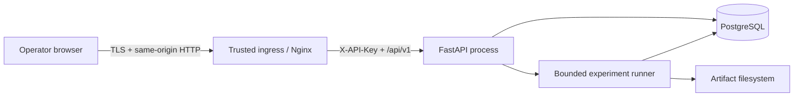

# OpenEnterprise Twin threat model

## Scope and assumptions

This threat model covers the public single-tenant reference deployment: browser, Nginx edge, FastAPI API, bounded experiment runner, PostgreSQL and the filesystem artifact store. It assumes TLS terminates at a trusted ingress, the company model contains commercially sensitive operating assumptions but no regulated personal data, and production operators configure a high-entropy API key.

Out of scope for this release are multi-tenant isolation, end-user identity federation, third-party plugin execution and ERP/CRM connectors. Those capabilities require a new threat-model review before implementation.

## Assets

| Asset | Security objective |
| --- | --- |
| Company/scenario assumptions | Confidentiality and integrity |
| Experiment requests and lifecycle | Integrity, availability and non-duplication |
| Simulation artifacts | Integrity, provenance and controlled disclosure |
| Comparisons and executive briefs | Integrity, traceability and publication stability |
| PostgreSQL credentials and API key | Confidentiality and rotation |
| Compute capacity | Availability and bounded consumption |
| Audit and trace identifiers | Integrity and operational usefulness |

## Trust boundaries

1. **Internet to edge.** Requests are untrusted until host, size and browser-security policy checks pass.
2. **Edge to API.** The edge injects the API key; clients must not receive it.
3. **API to persistence.** Pydantic/domain validation and parameterized SQLAlchemy queries constrain data crossing this boundary.
4. **Runner to artifacts.** Artifacts are written content-addressed and verified before decision evidence is used.
5. **Deployment control plane.** Environment variables, volumes, TLS and log collection are operator responsibilities.

## Primary threats and mitigations

| ID | Threat | Impact | Implemented mitigation | Residual action |
| --- | --- | --- | --- | --- |
| T1 | Unauthenticated read or experiment submission | Disclosure, manipulated decisions, compute abuse | Production startup requires `OPENENTERPRISE_TWIN_API_KEY`; all `/api/v1` resources except health require a constant-time checked key; Nginx injects it server-side | Rotate key and restrict ingress; adopt OIDC/RBAC before multiple user groups |
| T2 | Default or exposed database credentials | Complete data compromise | Compose requires an operator-supplied password and binds PostgreSQL to `127.0.0.1`; repository ignores `.env` | Use a secret manager and private network in deployed environments |
| T3 | Oversized JSON or excessive experiment request | Memory/CPU exhaustion | 1 MiB request-body limit, maximum 1,000 replications, bounded workers/queue and a default 50,000 simulated-period budget | Add per-principal rate limiting at ingress for public deployments |
| T4 | Duplicate or replayed experiment submission | Resource waste and confusing evidence | Bounded `Idempotency-Key`, payload conflict detection and immutable scenario identifiers | Set ingress request-rate alerts |
| T5 | Artifact tampering or mismatched shock tapes | False recommendation | SHA-256 content addressing, atomic writes, trace/result/tape digest reconciliation and paired tape-alignment checks | Store artifacts in versioned immutable object storage for multi-node operation |
| T6 | Host-header or cross-origin abuse | Poisoned routing or browser data access | Trusted-host middleware, deny-by-default CORS and same-origin production proxy | Configure exact production hosts and TLS ingress |
| T7 | Browser injection or clickjacking | Operator session/action compromise | CSP, `frame-ancestors 'none'`, `X-Frame-Options: DENY`, `nosniff`, restrictive permissions policy and no HTML rendering of model content | Keep dependencies patched and add CSP violation reporting at ingress |
| T8 | Secret persisted in browser or repository | Credential disclosure | API key remains at Nginx; scenario drafts use session storage; `.env` and artifacts are ignored | Clear browser session on shared workstations and rotate after suspected exposure |
| T9 | Invalid model input creates unsafe recommendation | Decision integrity loss | Strict Pydantic models, company compatibility validation, physical/accounting invariants, hard-constraint precedence and 30-run adoption gate | Calibrate and independently validate models before operational use |
| T10 | Stale or fabricated executive evidence | Governance failure | Briefs cite only computed metric IDs and carry model, assumptions, seed, replication, plugin and digest provenance | Export audit logs to append-only retention for regulated use |
| T11 | Dependency or container compromise | Code execution | Locked npm install, bounded Python versions, non-root backend image, minimal multi-stage images and CI security scanning | Pin reviewed release digests and sign production images |
| T12 | Sensitive data leaked in logs/errors | Confidentiality loss | Stable problem details suppress stack traces; audit records log route, status, subject and trace ID, not payload or key | Apply central-log access controls and retention policy |

## Security invariants

- Production configuration without an API key must fail closed at startup.
- Health endpoints expose only process status; business resources require authentication.
- A request cannot allocate more simulated periods than the configured budget.
- Candidate evidence cannot be compared unless baseline and candidate share seed, replication count, lifecycle, model/schema and aligned shock-tape digests.
- Exploratory evidence cannot produce an adoption decision.
- A hard guardrail breach always produces `do_not_adopt` regardless of upside metrics.
- Stored artifact content must match the digest referenced by PostgreSQL before it can support a brief.
- API errors never return Python stack traces or credentials.

## Deployment checklist

- Terminate TLS at a trusted ingress and expose only the Nginx service.
- Set exact trusted hosts, a high-entropy API key and a private PostgreSQL URL through a secret manager.
- Mount the artifact directory on encrypted durable storage with backups and restricted permissions.
- Run Alembic before application rollout; never grant the runtime role schema-owner permissions unnecessarily.
- Apply ingress rate limits, request timeouts and network policies around API, database and artifact storage.
- Send audit/application logs to centralized append-only storage and alert on repeated 401, 413, 422-budget and 429 responses.
- Run CI dependency, static-analysis, unit, PostgreSQL integration, container and browser release gates before deployment.

## Accepted residual risks

The release uses one shared API-key identity and an in-process worker, so it cannot provide per-user authorization, approval separation, horizontal failover or a durable distributed queue. The synthetic model is safe for demonstration but does not establish that a real-company decision is valid. These are explicit product boundaries, not controls delegated to the simulator.

## v0.3 closed-loop surfaces

The governed decision loop adds new input surfaces, each threat-modelled and mitigated:

- **Historical data ingestion** (`POST /api/v1/datasets`). Structured JSON only — no CSV/spreadsheet parsing on the server, so spreadsheet-formula injection cannot occur on ingest; observation counts are capped by `max_dataset_observations` and the global request-body limit; every field is schema-validated; provenance references are stored, never dereferenced, avoiding SSRF and path traversal.
- **Optimization jobs** (`POST /api/v1/optimizations`). The evaluation budget is capped server-side by `max_optimization_evaluations` and population/generation bounds, so a request cannot exhaust CPU; runs are deterministic and cached; results are content-addressed.
- **Adaptive policy DSL** (`/api/v1/adaptive-policies/*`). The language is closed: metrics, operators and actions are allow-listed literals, magnitudes are bounded, and there is no `eval`, expression parser or dynamic dispatch. Contradictory rules are rejected at validation. The DSL cannot express arbitrary computation or reach the host.
- **Decision ledger** (`/api/v1/ledger/decisions/*`). Transitions use optimistic concurrency (a conditional UPDATE guards against lost updates); approvals require separation of duties and are bound to the exact approved content digest, so approved evidence cannot be silently changed; the event log is append-only. Concurrent creation of the same decision surfaces as a clean `409`, never an unhandled error. Because this release uses one shared API-key identity, the ledger `actor` and `approver` labels (e.g. `cfo`, `ceo`) are declared by the caller and separation of duties is enforced on those labels; the authenticated principal is recorded in the append-only request audit log. Binding each label to a distinct authenticated user is an OIDC/RBAC deployment extension, consistent with the accepted residual risks below.
- **Outcome monitoring** (`/api/v1/ledger/decisions/{id}/outcomes`). Inputs are schema-validated and matched to existing predictions; alerts are deduplicated and cooldown-limited to prevent alert flooding.

All new surfaces inherit the existing controls — authentication, trusted-host validation, request-size limits, RFC 9457 problem responses without stack traces, and append-only audit logging of mutating requests. No secrets appear in code, examples or logs.
