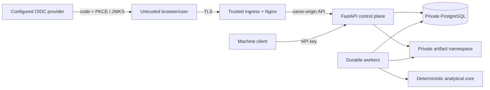

# OpenEnterprise Twin threat model

## Scope and assumptions

This model covers the v0.6 React application, Nginx edge, FastAPI API,
standalone or embedded durable workers, PostgreSQL state, content-addressed
filesystem artifacts and configured OIDC/JWKS traffic.

It assumes TLS terminates at a trusted ingress, PostgreSQL and artifact storage
are private, deployment secrets come from a secret manager, and operators
apply network controls, rate limits, backups and central logging. The included
Northstar data is synthetic. A deployment using real company data must add its
own classification, retention, privacy and regulatory controls.

## Assets

- OIDC access tokens, JWKS trust configuration and API-key service credentials.
- Subject, tenant and role assignments.
- Company models, scenarios, historical observations and calibrated parameters.
- Job requests, leases, progress, terminal problems and result references.
- Experiment traces, comparisons, recommendations and executive briefs.
- Decision-ledger events, approvals, outcome monitoring and audit records.
- PostgreSQL credentials, artifact contents, digests and backups.
- Availability of bounded simulation and analytics capacity.

## Trust boundaries

```mermaid
flowchart LR
    U["Untrusted browser/user"] -->|"TLS"| E["Trusted ingress + Nginx"]
    I["Configured OIDC provider"] -->|"code + PKCE / JWKS"| U
    E -->|"same-origin API"| A["FastAPI control plane"]
    M["Machine client"] -->|"API key"| A
    A --> P[("Private PostgreSQL")]
    A --> F["Private artifact namespace"]
    W["Durable workers"] --> P
    W --> F
    W --> K["Deterministic analytical core"]
```

Untrusted inputs include every URL, header, token, body, CSV cell, persisted
user value and job request. OIDC issuer/JWKS URLs and CSP identity origins are
trusted deployment configuration, not request-controlled destinations.

## Primary threats and mitigations

| ID | Threat | Impact | Implemented mitigation | Residual/operational control |
| --- | --- | --- | --- | --- |
| T1 | Missing, forged or replayed bearer | Unauthorized access | Strict algorithm/signature/issuer/audience/lifetime/claim validation; short-lived token contract; no tokens in URLs | Identity-provider revocation, MFA and short token lifetime |
| T2 | Malicious JWKS or key rotation abuse | Identity forgery or outage | Exact configured URL, HTTPS in production, no redirects, timeout/size cap, exact `kid`/algorithm match, bounded cache and one unknown-key refresh | Monitor provider health and rotation |
| T3 | Confused deputy between API key and OIDC | Privilege escalation | Authentication mode is exclusive; mixed credentials are rejected; browser proxy never injects service keys | Separate machine and human ingress policy |
| T4 | Frontend-only role bypass | Unauthorized mutation | FastAPI security dependencies enforce every protected route; frontend checks are UX only | Keep authorization matrix required in CI |
| T5 | Cross-tenant identifier probing | Confidentiality/integrity loss | Principal supplies tenant; repositories require tenant and filter all access; foreign keys and uniqueness are tenant-composite; inaccessible resources return `404` | PostgreSQL matrix tests and restricted DB access |
| T6 | Forged actor/approver identity | Governance fraud | Ledger identity derives from authenticated subject; approval policy and separation of duties are server-side | Identity-provider account governance |
| T7 | Duplicate or replayed analytical submission | Compute abuse/inconsistent evidence | Tenant+kind idempotency, canonical request comparison and `409` on conflicting reuse | Client-generated high-entropy idempotency keys |
| T8 | Two workers execute the same lease | Duplicate side effects | PostgreSQL skip-locked claim, lease owner checks and stale-writer rejection | Monitor stale leases and attempts |
| T9 | Worker dies while running | Stuck work/availability loss | Lease expiry, bounded retry, restart recovery and terminal `lease_expired` | Worker supervision and queue-age alerts |
| T10 | Cancellation races with completion | Incorrect terminal state | Cooperative safe-point checks and atomic terminal transitions | Preserve job/audit evidence during incidents |
| T11 | Unbounded analytics or upload | CPU/memory denial of service | Request/body, row, period, evaluation, population and replication caps | Ingress rate limits and capacity planning |
| T12 | SQL, command, template or DSL injection | Code/data compromise | SQLAlchemy parameterization; no shell execution in request paths; no server templates; closed allow-listed adaptive DSL without `eval` | Static analysis and dependency updates |
| T13 | CSV formula injection | Client-side code execution | Export neutralises `=`, `+`, `-` and `@`; import treats cells as data | Open exports in patched spreadsheet software |
| T14 | XSS steals session-scoped bearer | Account compromise | React escaping, no raw-HTML sinks, strict CSP, self-hosted dependencies and short-lived session token | CSP provider allowlist, rapid token expiry and IdP session controls |
| T15 | Arbitrary outbound fetch / SSRF | Internal network access | No request-controlled outbound connector; OIDC fetch uses configured URL only | Future connectors require destination/IP controls |
| T16 | Artifact tampering or mismatch | Fabricated evidence | Canonical SHA-256 addressing, digest verification, atomic write and DB digest reference | Encrypted durable storage and coherent backups |
| T17 | Stale or fabricated executive evidence | Bad decision/governance failure | Briefs cite computed metric IDs and retain model, assumptions, seed, replication and digest provenance; evidence gate blocks exploratory adoption | Independent model validation |
| T18 | Sensitive error/log/metric labels | Confidentiality loss | Stable RFC 9457 responses, payload-free audit, no token/key logging and bounded aggregate labels | Central-log access/retention controls |
| T19 | Dependency or image compromise | Code execution | Hash-pinned Python runtime, npm lock, audits, CodeQL, multi-stage images and non-root API runtime | Pin/sign reviewed production image digests |
| T20 | Host, framing or browser-policy abuse | Phishing/XSS amplification | Trusted hosts, `frame-ancestors`/DENY, `nosniff`, referrer/permissions policy, no-store and CSP | Verify runtime ingress headers |

## Security invariants

- Production rejects `local` authentication.
- OIDC production configuration uses HTTPS and an asymmetric algorithm
  allowlist.
- API-key mode maps one secret to one explicit service-account subject, tenant
  and role set; it is not a browser session.
- A request cannot select or override its tenant.
- Every business repository requires a tenant and cannot return a row owned by
  another tenant.
- Frontend visibility never grants API authorization.
- A ledger actor cannot approve the same governed decision as another claimed
  identity.
- A job has at most one valid lease owner; stale workers cannot heartbeat,
  complete or fail it.
- Terminal jobs never return to an active state.
- A result link exists only for a succeeded job with a persisted digest.
- A request cannot allocate work beyond configured analytical budgets.
- Candidate evidence cannot be compared unless baseline and candidate have
  compatible seed, replication, lifecycle, versions and shock-tape evidence.
- Exploratory evidence cannot produce adoption.
- A hard guardrail breach always produces `do_not_adopt`.
- Stored artifact content must match the digest referenced by PostgreSQL.
- API responses never return Python tracebacks, credentials or tokens.

## OIDC and browser controls

The browser uses authorization code + PKCE as a public client. OIDC transaction
state and the short-lived user are held in `sessionStorage` to survive the
redirect; the active API token is copied into application memory and attached
only to strict relative API paths. `apiFetch` rejects absolute and
scheme-relative destinations before adding authorization.

Because any same-origin XSS can read JavaScript-accessible tokens, the frontend:

- has no `dangerouslySetInnerHTML`, direct HTML insertion or dynamic code
  execution;
- self-hosts scripts, styles and fonts;
- enforces a CSP without `unsafe-inline` or `unsafe-eval`;
- adds only the exact OIDC origin to `connect-src`;
- uses React text rendering for API-provided values;
- publishes no browser client secret or API key.

This is defense in depth, not a claim that Web Storage is immune to XSS.

## Durable-job abuse and recovery

Job payloads reference tenant-owned resources and are validated before
submission. Idempotency prevents accidental duplicate work, while kind-specific
budgets cap compute. Workers use short claim transactions, execute outside
transactions, heartbeat in a separate thread and commit only while retaining
the lease.

Expired leases are requeued only within the attempt budget. Handler
side-effects are source-job-idempotent, so recovery cannot create a second
logical optimization or experiment. Cancellation is requested, persisted and
observed at safe points. Job problems expose stable codes/details, not internal
exceptions.

## Deployment checklist

- Terminate TLS at a trusted ingress and expose only the frontend edge.
- Configure exact trusted hosts and either OIDC or a machine-only API key.
- Register exact callback/logout URLs and use authorization code + PKCE.
- Set `OIDC_CONNECT_SRC` to one exact HTTPS identity-provider origin.
- Keep PostgreSQL private and use a runtime role without unnecessary schema
  ownership.
- Give every API/worker the same release, database and artifact namespace.
- Keep heartbeat shorter than lease and termination grace longer than job
  shutdown timeout.
- Mount artifacts on encrypted durable storage with coherent database backups.
- Apply ingress rate, body and timeout controls.
- Centralize payload-free audit/application logs and alert on repeated
  authentication, authorization, budget and stale-lease events.
- Run locked audits, CodeQL, PostgreSQL migrations/isolation/concurrency,
  container and live OIDC browser gates before deployment.
- Monitor `/health`, `/ready`, queue age, attempts and stale leases separately.

## Accepted residual risks

- The filesystem artifact adapter is multi-node only when backed by a genuinely
  shared durable filesystem; object storage is not yet included.
- PostgreSQL is both transaction store and work queue. It is appropriate for
  the current bounded scale, not claimed as a high-throughput broker.
- Browser OIDC tokens remain exposed to a successful same-origin XSS until they
  expire.
- The built-in API-key adapter has one active secret and no overlapping
  rotation window.
- Metrics are process-local, not fleet-wide telemetry.
- The synthetic model demonstrates mechanics but does not validate a real
  company's decision.

These boundaries are explicit product constraints, not security controls
delegated to the simulation engine.
