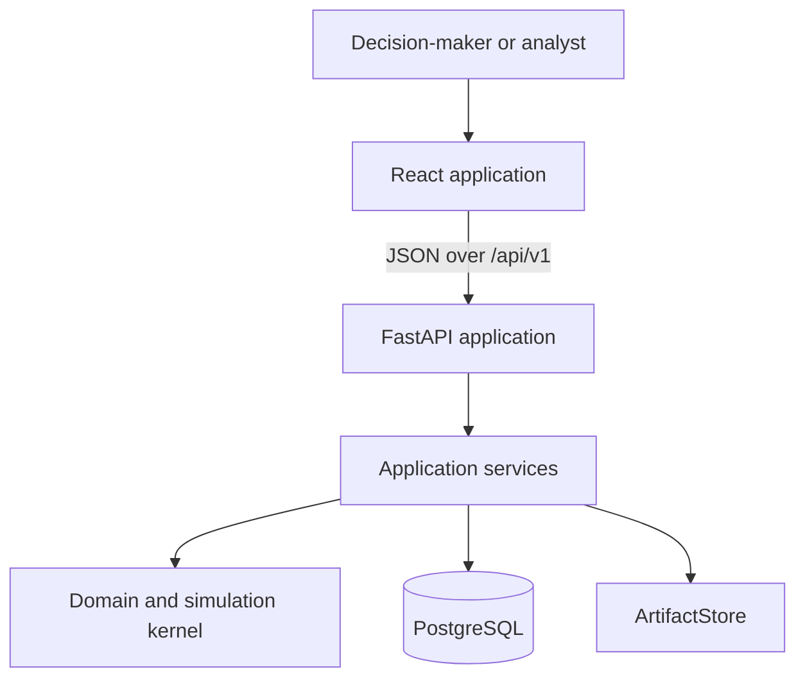
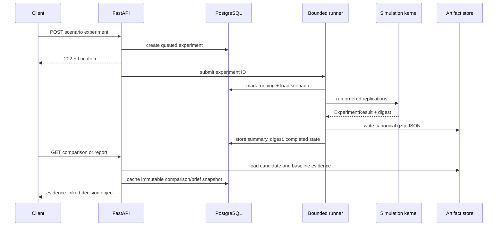
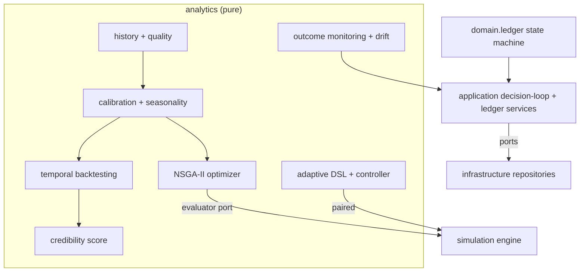

# Architecture

OpenEnterprise Twin 0.2 is a monorepo with a React client and a modular Python monolith. PostgreSQL stores transactional lifecycle state; large immutable experiment results live in a content-addressed artifact store. The architecture optimizes for explainability, governed decisions and replaceable boundaries before distributed scale.

## System context

The browser owns interaction and presentation. FastAPI owns validation, transport errors and dependency wiring. Application services own durable experiment execution and decision assembly. The kernel owns business transitions, Monte Carlo aggregation, paired comparison and evidence-linked reporting.

## Backend boundaries

| Package | Responsibility | May depend on |
| --- | --- | --- |
| `domain` | Immutable company, scenario and ledger contracts; domain errors | Pydantic and standard library |
| `simulation` | Shock tapes, daily transitions, invariants, metrics and experiments | `domain`, NumPy |
| `scenarios` | Paired baseline/candidate comparison and materiality rules | `domain`, `simulation` |
| `reporting` | Deterministic recommendation, mechanisms and brief provenance | `domain`, `scenarios` |
| `plugins` | Infrastructure-free protocols, manifests and compatibility registry | Typed analytical contracts |
| `application` | Experiment lifecycle and persisted decision evidence | Core packages and repository/artifact interfaces |
| `infrastructure` | Settings, SQLAlchemy models/repositories and filesystem artifacts | PostgreSQL/SQLAlchemy adapters |
| `api` | FastAPI schemas, routes, errors and runtime composition | Application and infrastructure |

Import Linter enforces that `domain`, `simulation` and `plugins` do not import API or infrastructure modules. Application services depend on explicit repository and artifact-reader ports; SQLAlchemy and filesystem implementations remain at the infrastructure edge.

## Experiment data flow

The API returns `202 Accepted` for experiment creation. Lifecycle states are `queued`, `running`, `completed` and `failed`. A bounded semaphore caps active plus queued work; each experiment separately caps process workers used for replications. Simulation work runs outside database transactions.

## Persistence

`scenarios` stores the complete validated scenario JSON. `experiments` stores request identity, compatible baseline ID, lifecycle timestamps, summary payloads, comparison/brief snapshots and artifact digest. The initial Alembic migration uses PostgreSQL JSONB while retaining JSON compatibility for isolated SQLite tests. Persisted briefs carry their own schema version; known legacy JSON shapes are upgraded once on read while preserving publication timing.

`FileArtifactStore` canonicalizes JSON, computes SHA-256, writes deterministic gzip (`mtime=0`) to a temporary file, fsyncs it and atomically renames it. Transaction tables retain only the digest and compact result summary. Production replicas require a shared implementation of the same content-addressed behavior.

## API surface

The implemented public resources are:

- `GET /api/v1/health`
- `GET /api/v1/company`
- `GET /api/v1/baseline`
- `GET /api/v1/scenarios`
- `POST /api/v1/scenarios`
- `GET /api/v1/scenarios/{scenario_id}`
- `POST /api/v1/scenarios/{scenario_id}/experiments`
- `GET /api/v1/experiments/{experiment_id}`
- `GET /api/v1/experiments/{experiment_id}/comparison`
- `GET /api/v1/experiments/{experiment_id}/report`
- `GET /api/v1/decisions`
- `GET /api/v1/frontier`
- `GET /health` for process liveness

Scenario and decision collections are bounded and cursor-aware. Errors use `application/problem+json` with stable `code`, `detail`, `trace_id` and field violations. `Idempotency-Key` prevents duplicate experiment creation and returns a conflict if reused for different inputs. A candidate experiment requires a completed baseline with the same seed and replication count.

Production mode requires `X-API-Key` on every business resource, disables interactive OpenAPI surfaces, validates host headers and enforces request-size and simulation-period budgets. The supplied Nginx proxy injects the key server-side so browser code never persists it. Mutating requests emit payload-free audit events with principal, route, status and trace ID.

## Reproducibility boundary

Business transitions never generate random values. Before a trace begins, the stochastic module materializes an immutable tape using a counter-keyed Philox generator. Stable keys include tape version, master seed, replication, process, day, entity and draw ID. A trace records company, scenario, engine and tape versions; resolved-assumption and tape hashes; seed and replication; and its own content digest.

Experiment, comparison and brief objects each add canonical content digests and validate their source evidence before use. The detailed contract is in [model.md](model.md).

## Local and production operation

`make dev` owns the local order: install dependencies, start healthy PostgreSQL, migrate, seed the baseline, then start API and Vite. `make demo` is intentionally an API client; it does not bypass public scenario and experiment contracts.

The backend Dockerfile uses a Python 3.12 multi-stage build, copies only the installed environment plus migration assets, runs as UID/GID `10001`, writes artifacts to `/app/artifacts` and exposes a liveness health check. The frontend image builds the typed React bundle and serves it through Nginx on port `8080`; `/api/` is proxied to the configurable `API_UPSTREAM`, keeping browser traffic same-origin. Nginx applies CSP, framing, MIME, referrer and browser-permission controls. Database migrations remain an explicit deployment step before application rollout. Secrets and the production database URL are injected at runtime.

## Extension boundary

The plugin registry supports demand, operations, finance, risk metric, optimization and report-section capabilities. Manifests declare SemVer identity, inclusive engine compatibility and scalar configuration fields. Runtime adapters revalidate inputs and outputs at each call. Plugins receive immutable typed evidence—not database sessions, request objects or mutable engine state.

0.2 uses explicit registration. Entry-point discovery, process isolation and a stable external SDK are later release concerns.

## Known architectural gaps

- In-process execution cannot provide horizontal worker failover.
- The filesystem artifact adapter is single-node unless mounted on shared durable storage.
- API-key authentication is single-tenant; OIDC, role authorization, tenancy and approval separation are not implemented.
- Readiness is not yet separated from the `/health` liveness endpoint.
- Cross-origin development requires a constrained CORS allowlist; production should prefer the supplied same-origin frontend proxy.

## Governed decision loop (v0.3)

v0.3 adds a pure `analytics` layer alongside `domain` and `simulation`, held to the same import contract: it never imports delivery infrastructure. It turns operating history into an operational decision system.

- **Determinism & provenance.** Every analytics artifact — datasets, calibrations, credibility scores, backtests, optimizations, adaptive evaluations, decision packets and monitoring reports — is content-addressed with a SHA-256 digest over its canonical JSON, and every stochastic step is seeded.
- **Calibration.** Parameters are tagged `observed`, `estimated` or `assumed`; confidence intervals use the normal approximation of the sampling error of the mean; the dominant weekly-vs-yearly seasonality is selected by amplitude. Backtesting always splits on time, never at random.
- **Credibility Score.** A documented weighted mean of seven components (data quality, temporal coverage, backtest error, interval coverage, parameter stability, assumed ratio, recent drift) on a 0–100 scale with explicit interpretation bands.
- **Optimizer.** NSGA-II with constraint-domination and crowding distance over a pluggable `CandidateEvaluator`; production wraps the deterministic experiment engine, an evaluation cache respects the compute budget, and results expose the frontier, robustness, sensitivity and convergence evidence.
- **Adaptive DSL.** A closed language — allow-listed metrics, operators and actions, bounded magnitudes, no expression evaluation — validated for contradictions; the controller is deterministic and fully audited.
- **Decision ledger.** The state machine and tamper-evident packet live in `domain.ledger`; the application service enforces optimistic concurrency, separation of duties and evidence immutability; an append-only event table backs a versioned snapshot.
- **Monitoring.** Realised outcomes are reconciled against the decision's prediction with a documented, explainable alert ladder; drift is decomposed across data, parameters and results with a recalibration threshold.

Persistence adds four portable SQLite/PostgreSQL tables (`historical_datasets`, `calibrations`, `optimizations`, `monitoring_reports`) plus the ledger tables, through reversible Alembic migrations `0002` and `0003`. Long-running analytics (optimization, adaptive comparison) run synchronously under strict server-side budgets so requests stay responsive; a durable async job runner remains a deployment extension.
