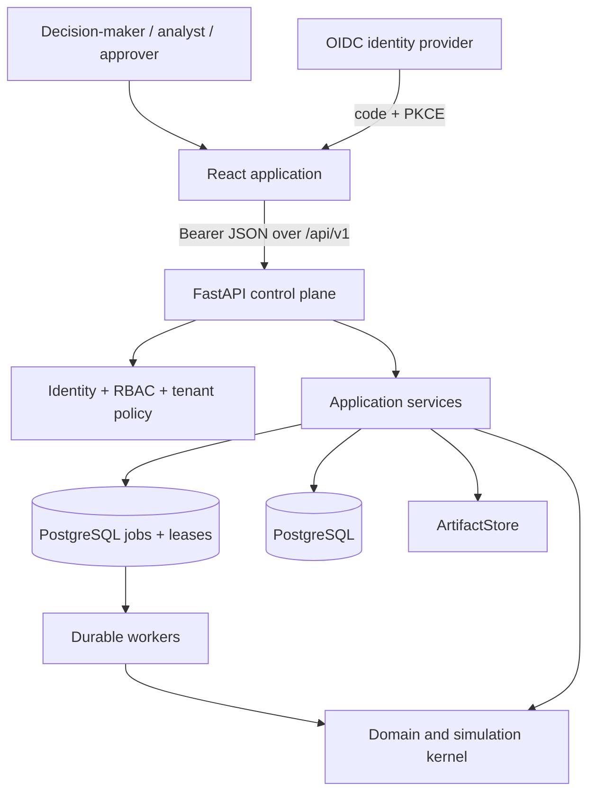
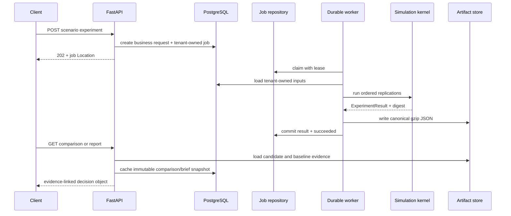
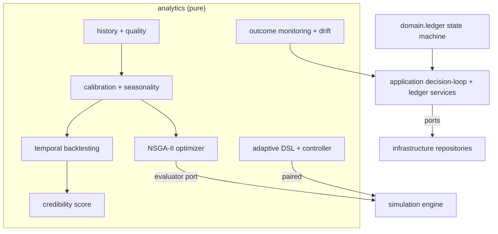

# Architecture

OpenEnterprise Twin v0.6 is a monorepo with an identity-aware React decision
cockpit, a FastAPI control plane and independently deployable durable workers.
PostgreSQL stores tenant-owned transactional state and job leases; large
immutable results live in a content-addressed filesystem artifact store. The
architecture optimizes for explainability, governed decisions, deterministic
replay and replaceable infrastructure boundaries.

## System context

```mermaid
flowchart TB
    USER["Decision-maker / analyst / approver"] --> WEB["React application"]
    IDP["OIDC identity provider"] -->|"code + PKCE"| WEB
    WEB -->|"Bearer JSON over /api/v1"| HTTP["FastAPI control plane"]
    HTTP --> POLICY["Identity + RBAC + tenant policy"]
    HTTP --> SERVICES["Application services"]
    SERVICES --> JOBS[("PostgreSQL jobs + leases")]
    JOBS --> WORKERS["Durable workers"]
    WORKERS --> KERNEL["Domain and simulation kernel"]
    SERVICES --> KERNEL["Domain and simulation kernel"]
    SERVICES --> POSTGRES[("PostgreSQL")]
    SERVICES --> ARTIFACTS["ArtifactStore"]
```

The browser owns interaction and presentation. FastAPI owns validation,
transport errors, authentication, authorization, operational probes and
dependency wiring. Application services own use cases and decision assembly.
Workers claim tenant-owned jobs with leases and execute handlers outside the
HTTP lifecycle. The kernel owns business transitions and Monte Carlo
aggregation; `scenarios` owns paired comparison, and `reporting` owns
evidence-linked recommendations and briefs.

## Backend boundaries

| Package | Responsibility | May depend on |
| --- | --- | --- |
| `domain` | Immutable company, scenario and ledger contracts; domain errors | Pydantic and standard library |
| `simulation` | Shock tapes, daily transitions, invariants, metrics and experiments | `domain`, NumPy |
| `scenarios` | Paired baseline/candidate comparison and materiality rules | `domain`, `simulation` |
| `reporting` | Deterministic recommendation, mechanisms and brief provenance | `domain`, `scenarios` |
| `plugins` | Infrastructure-free protocols, manifests and compatibility registry | Typed analytical contracts |
| `application` | Identity contracts, job commands/handlers, experiment lifecycle and decision evidence | Core packages and repository/artifact interfaces |
| `infrastructure` | OIDC/API-key adapters, SQLAlchemy models/repositories, job workers and filesystem artifacts | PostgreSQL/SQLAlchemy adapters |
| `api` | FastAPI schemas, routes, RBAC, errors and runtime composition | Application and infrastructure |

Import Linter enforces that `domain`, `simulation` and `plugins` do not import API or infrastructure modules. Application services depend on explicit repository and artifact-reader ports; SQLAlchemy and filesystem implementations remain at the infrastructure edge.

## Experiment data flow

```mermaid
sequenceDiagram
    participant C as Client
    participant A as FastAPI
    participant P as PostgreSQL
    participant J as Job repository
    participant W as Durable worker
    participant S as Simulation kernel
    participant F as Artifact store

    C->>A: POST scenario experiment
    A->>P: create business request + tenant-owned job
    A-->>C: 202 + job Location
    W->>J: claim with lease
    W->>P: load tenant-owned inputs
    W->>S: run ordered replications
    S-->>W: ExperimentResult + digest
    W->>F: write canonical gzip JSON
    W->>J: commit result + succeeded
    C->>A: GET comparison or report
    A->>F: load candidate and baseline evidence
    A->>P: cache immutable comparison/brief snapshot
    A-->>C: evidence-linked decision object
```

Every expensive analytical submission returns `202 Accepted`. Job lifecycle
states are `queued`, `running`, `succeeded`, `failed` and `cancelled`.
PostgreSQL skip-locked claiming distributes work without duplicate lease
ownership. Heartbeats extend leases; cancellation is observed at safe points;
expired leases are retried within an attempt budget. Each experiment separately
caps process workers used for replications. Analytical work runs outside
database transactions.

## Persistence

Every mutable business table carries a non-null `tenant_id`. Composite unique
constraints and foreign keys prevent cross-tenant references, while
repositories require a tenant at construction and scope every query.
`scenarios` stores validated scenario JSON. `experiments` stores request
identity, compatible baseline ID, lifecycle timestamps, summary payloads,
comparison/brief snapshots and artifact digest. `jobs` stores kind, idempotency,
creator, attempt/progress state, lease, cancellation, terminal problem and
result reference. PostgreSQL JSONB retains JSON compatibility for isolated
SQLite tests.

`FileArtifactStore` canonicalizes JSON, computes SHA-256, writes deterministic gzip (`mtime=0`) to a temporary file, fsyncs it and atomically renames it. Transaction tables retain only the digest and compact result summary. Production replicas require a shared implementation of the same content-addressed behavior.

## API surface

The principal public and protected resources are:

- `GET /health` — public, dependency-free process liveness
- `GET /api/v1/health`
- `GET /ready` — public PostgreSQL and artifact-store readiness
- `GET /api/v1/system/info` — protected safe release/build metadata
- `GET /api/v1/system/metrics` — protected bounded process metrics
- `GET /api/v1/session` — safe effective subject, tenant, roles and auth method
- `GET /api/v1/company`
- `GET /api/v1/baseline`
- `GET /api/v1/scenarios`
- `POST /api/v1/scenarios`
- `GET /api/v1/scenarios/{scenario_id}`
- `POST /api/v1/scenarios/{scenario_id}/experiments`
- `GET /api/v1/experiments/{experiment_id}`
- `GET /api/v1/experiments/{experiment_id}/comparison`
- `GET /api/v1/experiments/{experiment_id}/report`
- `GET /api/v1/decisions`
- `GET /api/v1/frontier`
- `GET /api/v1/jobs`
- `GET /api/v1/jobs/{job_id}`
- `POST /api/v1/jobs/{job_id}/cancellation`
- `GET /api/v1/jobs/{job_id}/result`

The calibration, optimization, adaptive-policy, decision-ledger and monitoring
routers extend the same `/api/v1` contract. Scenario and decision collections
are bounded and cursor-aware. Errors use `application/problem+json` with stable
`code`, `detail`, `trace_id` and field violations. `Idempotency-Key` prevents
duplicate experiment creation and returns a conflict if reused for different
inputs. A candidate experiment requires a completed baseline with the same seed
and replication count.

Production requires explicit `oidc` or `api_key` authentication. OIDC validates
signature, algorithm, issuer, audience, lifetime and mandatory identity claims;
API-key mode maps one transport secret to one tenant-bound machine principal.
Router security dependencies enforce role policy, and repositories enforce
object-level tenant scope. `/health`, `/api/v1/health` and `/ready` remain
public for orchestrators. Production disables interactive OpenAPI, validates
host headers and enforces request and compute budgets. Mutating requests emit
payload-free audit events bound to the authenticated principal, route, status
and trace ID.

## Security and operations contracts

v0.6 gives identity, process health, dependency health and operator evidence distinct
contracts:

| Contract | Meaning | Failure behaviour |
| --- | --- | --- |
| `/health` | The FastAPI process can answer HTTP | Always dependency-free; returns only `{"status":"ok"}` |
| `/ready` | PostgreSQL answers `SELECT 1` and the artifact directory passes an exclusive write, `fsync`, read and cleanup probe | Returns RFC 9457 `503 service_not_ready` without dependency details |
| `/api/v1/system/info` | Package version, deployment environment, optional validated Git commit and implemented capability identifiers | Requires the configured principal |
| `/api/v1/system/metrics` | Process uptime plus aggregate HTTP count and duration | Requires the configured principal; labels are bounded to method, registered route template and status family |
| `/api/v1/jobs` | Tenant-scoped durable workload state | Requires a reader role; cancellation requires analyst or admin |

Every API response receives `nosniff`, `no-referrer`, `DENY` framing, a
restrictive browser permissions policy and `Cache-Control: no-store`. Unknown
paths are aggregated as `unmatched`; metric labels never contain scenario,
tenant, user or trace identifiers. Metrics are intentionally process-local and
reset on restart.

The exact startup, probe, backup, restore, shutdown, audit, triage and rollback
procedures are in the [operator runbook](operations.md).

## Reproducibility boundary

Business transitions never generate random values. Before a trace begins, the stochastic module materializes an immutable tape using a counter-keyed Philox generator. Stable keys include tape version, master seed, replication, process, day, entity and draw ID. A trace records company, scenario, engine and tape versions; resolved-assumption and tape hashes; seed and replication; and its own content digest.

Experiment, comparison and brief objects each add canonical content digests and validate their source evidence before use. The detailed contract is in [model.md](model.md).

## Local and production operation

`make dev` owns the local order: install dependencies, start healthy PostgreSQL, migrate, seed the baseline, then start API and Vite. `make demo` is intentionally an API client; it does not bypass public scenario and experiment contracts.

The backend Dockerfile uses a Python 3.12 multi-stage build, copies only the
installed environment plus migration assets, runs as UID/GID `10001`, writes
artifacts to `/app/artifacts` and exposes a liveness health check. The same
image can run the API or `openenterprise-twin-worker`. The frontend image builds
the typed React bundle and serves it through Nginx on port `8080`; `/api/` is
proxied to `API_UPSTREAM`, keeping browser traffic same-origin. Nginx applies
CSP, framing, MIME, referrer and browser-permission controls. For OIDC, the
exact provider origin is added to CSP through `OIDC_CONNECT_SRC`. The proxy
never injects API keys into browser requests.

## Extension boundary

The plugin registry supports demand, operations, finance, risk metric, optimization and report-section capabilities. Manifests declare SemVer identity, inclusive engine compatibility and scalar configuration fields. Runtime adapters revalidate inputs and outputs at each call. Plugins receive immutable typed evidence—not database sessions, request objects or mutable engine state.

v0.6 uses explicit registration. Entry-point discovery, process isolation and a
stable external SDK are later release concerns.

## Known architectural gaps

- The filesystem artifact adapter is single-node unless mounted on shared durable storage.
- The built-in API-key adapter represents one service account; many machine identities require an external gateway or identity adapter.
- Operational metrics are process-local JSON aggregates, not a distributed telemetry backend.
- Job orchestration uses PostgreSQL rather than a dedicated broker; this is deliberate for the current scale boundary.
- Cross-origin development requires a constrained CORS allowlist; production should prefer the supplied same-origin frontend proxy.

## Governed decision loop

Introduced in v0.3 and retained in v0.6, the pure `analytics` layer sits
alongside `domain` and `simulation` under the same import contract: it never
imports delivery infrastructure. It turns operating history into an
operational decision system.

```mermaid
flowchart TD
    subgraph analytics["analytics (pure)"]
        HIST["history + quality"]
        CALIB["calibration + seasonality"]
        BACK["temporal backtesting"]
        CRED["credibility score"]
        OPT["NSGA-II optimizer"]
        ADAPT["adaptive DSL + controller"]
        MON["outcome monitoring + drift"]
    end
    HIST --> CALIB --> BACK --> CRED
    CALIB --> OPT
    OPT -->|evaluator port| ENGINE["simulation engine"]
    ADAPT -->|paired| ENGINE
    LEDGER["domain.ledger state machine"] --> APPSVC["application decision-loop + ledger services"]
    APPSVC -->|ports| REPO["infrastructure repositories"]
    MON --> APPSVC
```

- **Determinism & provenance.** Every analytics artifact — datasets, calibrations, credibility scores, backtests, optimizations, adaptive evaluations, decision packets and monitoring reports — is content-addressed with a SHA-256 digest over its canonical JSON, and every stochastic step is seeded.
- **Calibration.** Parameters are tagged `observed`, `estimated` or `assumed`; confidence intervals use the normal approximation of the sampling error of the mean; the dominant weekly-vs-yearly seasonality is selected by amplitude. Backtesting always splits on time, never at random.
- **Credibility Score.** A documented weighted mean of seven components (data quality, temporal coverage, backtest error, interval coverage, parameter stability, assumed ratio, recent drift) on a 0–100 scale with explicit interpretation bands.
- **Optimizer.** NSGA-II with constraint-domination and crowding distance over a pluggable `CandidateEvaluator`; production wraps the deterministic experiment engine, an evaluation cache respects the compute budget, and results expose the frontier, robustness, sensitivity and convergence evidence.
- **Adaptive DSL.** A closed language — allow-listed metrics, operators and actions, bounded magnitudes, no expression evaluation — validated for contradictions; the controller is deterministic and fully audited.
- **Decision ledger.** The state machine and tamper-evident packet live in `domain.ledger`; the application service enforces optimistic concurrency, separation of duties and evidence immutability; an append-only event table backs a versioned snapshot.
- **Monitoring.** Realised outcomes are reconciled against the decision's prediction with a documented, explainable alert ladder; drift is decomposed across data, parameters and results with a recalibration threshold.

Persistence includes tenant-owned scenarios, experiments, datasets,
calibrations, optimizations, monitoring, ledger and jobs through reversible
Alembic migrations up to `0007`. Experiment, calibration, optimization and
adaptive comparison all execute through the durable async job contract.

Identity configuration is detailed in
[identity-and-access.md](identity-and-access.md); worker semantics and recovery
are detailed in [jobs.md](jobs.md).
