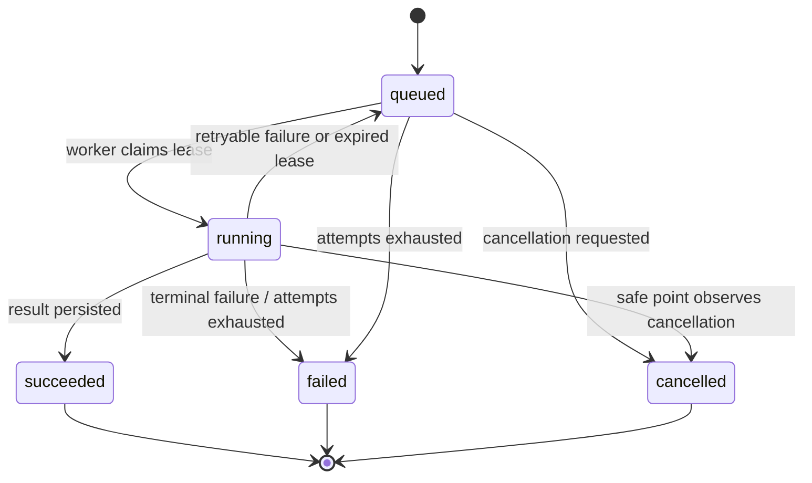

# Durable analytical jobs

OpenEnterprise Twin v0.6 executes experiments, calibration, optimization and
adaptive comparisons through one PostgreSQL-backed lifecycle.

## HTTP contract

Analytical submission endpoints return `202 Accepted`, a `Location` header and
a job resource:

```json
{
  "job_id": "f23a64e4-1ec3-46a7-9c64-b60341860e93",
  "kind": "optimization",
  "status": "queued",
  "created_by": "finance-analyst",
  "attempt_count": 0,
  "max_attempts": 3,
  "progress": 0,
  "stage": "queued",
  "result_location": null,
  "problem": null
}
```

Use:

- `GET /api/v1/jobs` for tenant-scoped history and filters;
- `GET /api/v1/jobs/{job_id}` for progress;
- `POST /api/v1/jobs/{job_id}/cancellation` to request cancellation;
- `GET /api/v1/jobs/{job_id}/result` after success.

Submission idempotency is scoped by tenant, workload kind and
`Idempotency-Key`. Reusing a key for different input returns
`409 idempotency_conflict`.

## Lifecycle



The API never treats queue acceptance as analytical success. A result link is
published only after the worker has written and verified the content-addressed
artifact and committed the terminal job state.

## Claiming and leases

A worker claims one eligible job inside a short transaction. PostgreSQL uses
row locking with skip-locked semantics so concurrent workers cannot own the
same lease. The claim records:

- worker identifier;
- lease expiry;
- attempt count;
- start/update timestamps.

While the handler runs, a heartbeat extends the lease and reports bounded
progress and a safe stage label. Writes from a stale or different worker are
rejected. Expired leases are recovered before the next claim:

- work below its attempt budget returns to `queued`;
- exhausted work becomes `failed` with stable code `lease_expired`.

Handlers are idempotent against the source job. Re-executing a recovered
optimization, for example, returns the existing tenant-owned result instead of
creating a second logical resource.

## Worker deployment

For a small single-node deployment, run workers inside the API:

```bash
OPENENTERPRISE_TWIN_JOB_WORKER_MODE=embedded
OPENENTERPRISE_TWIN_JOB_WORKERS=2
```

For independent scaling and restart control, run the API without embedded
workers and start one or more worker processes against the same PostgreSQL and
artifact store:

```bash
OPENENTERPRISE_TWIN_JOB_WORKER_MODE=external
openenterprise-twin-worker
```

Relevant settings:

```bash
OPENENTERPRISE_TWIN_JOB_WORKERS=2
OPENENTERPRISE_TWIN_JOB_POLL_INTERVAL_SECONDS=0.25
OPENENTERPRISE_TWIN_JOB_LEASE_SECONDS=30
OPENENTERPRISE_TWIN_JOB_HEARTBEAT_SECONDS=10
OPENENTERPRISE_TWIN_JOB_RETRY_DELAY_SECONDS=2
OPENENTERPRISE_TWIN_JOB_SHUTDOWN_TIMEOUT_SECONDS=10
```

The heartbeat interval must remain shorter than the lease. Use a lease
comfortably longer than the longest expected scheduling pause, but short enough
to recover a dead worker within the operational objective.

All workers and APIs for a deployment must share:

- the same PostgreSQL database;
- the same content-addressed artifact namespace;
- compatible application and migration versions;
- the same tenant and identity policy.

The included filesystem artifact adapter is safe for one node or a genuinely
shared durable mount. Multi-node deployments should not use independent local
artifact directories.

## Cancellation

Cancellation is cooperative:

1. the API records `cancellation_requested_at`;
2. the active handler checks cancellation at deterministic safe points;
3. the worker commits `cancelled` and releases the lease.

The request is idempotent. A terminal job cannot be moved back to an active
state, and the UI offers cancellation only to `analyst` or `admin` while the
job is active.

## Backlog and recovery runbook

### Queue age is rising

1. Confirm `/ready` passes.
2. As an administrator, inspect `/api/v1/system/metrics` and
   `/api/v1/jobs?status=queued`.
3. Verify at least one compatible worker is running.
4. Check database connectivity, artifact writability and worker logs by trace
   and job ID.
5. Add workers only when they share the same artifact namespace and resource
   budgets.
6. Do not delete queued rows to relieve pressure; cancel through the API when
   work is no longer required.

### Worker crashed

1. Stop or isolate the unhealthy process.
2. Preserve its logs and worker identifier.
3. Start a compatible replacement worker.
4. Wait for the old lease to expire; recovery is automatic on the next claim.
5. Confirm the job either retries with a higher attempt count or fails with
   `lease_expired`.
6. Verify a stale worker cannot commit after replacement ownership.

### Job repeatedly fails

1. Read the stable `problem.code`, `detail` and trace ID from the job.
2. Validate input budgets and referenced tenant resources.
3. Check dependency readiness and artifact storage.
4. Preserve the failed job as evidence; submit a corrected request with a new
   idempotency key.
5. Do not edit terminal job rows or artifact digests manually.

### Graceful shutdown

Stop accepting new traffic, request process termination and allow at least
`OPENENTERPRISE_TWIN_JOB_SHUTDOWN_TIMEOUT_SECONDS`. An interrupted handler
retains its lease; a replacement recovers it only after expiry. Never force two
workers to use the same configured worker identifier.

## Evidence and observability

The Jobs UI defaults to work created by the current subject in the active
tenant and shows state, stage, progress, attempts, cancellation, safe problem
details and result links.

Operational metrics are aggregate and bounded. They report queue state and
stale leases without using tenant, user, scenario or job identifiers as metric
labels. Job identifiers may appear in structured application logs for
traceability but payloads, tokens and credentials must not.

