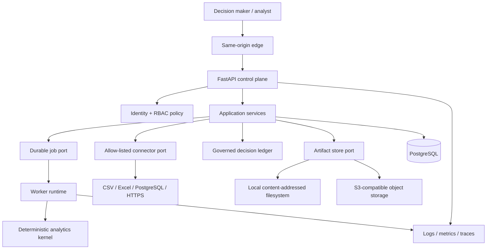

# OpenEnterprise Twin — Enterprise-Grade Roadmap Design

## Objective

Evolve OpenEnterprise Twin from a strong single-tenant reference product into
a production-grade, publicly credible decision intelligence platform without
losing its defining properties: deterministic evidence, explainability,
governed decisions, bounded computation and a low-friction local experience.

The target is not a cosmetic “10/10”. Each maturity claim must be backed by a
runtime capability, an automated gate, an operator-facing contract or public
documentation that states the remaining boundary precisely.

## Approaches considered

### 1. Immediate distributed rewrite

Split the modular monolith into API, worker, identity, connector and reporting
services from the outset.

This maximises architectural spectacle but creates distributed transactions,
deployment complexity and versioning overhead before the product has enough
operational load to justify them. It also weakens the current deterministic
core by moving too many boundaries at once.

### 2. Enterprise-ready modular monolith

Retain the tested Python and React applications while introducing explicit
ports for identity, jobs, artifacts, connectors and telemetry. Provide durable
SQL-backed default adapters and optional production adapters behind the same
contracts.

This is the selected approach. It keeps local execution direct, preserves the
analytical kernel and creates clean extraction seams if future scale justifies
separate services.

### 3. Cloud-platform-first implementation

Centre the project on Kubernetes, a managed queue, object storage and an
external identity provider.

This would demonstrate deployment engineering but make the repository costly
to run and difficult to evaluate locally. Cloud adapters remain supported, but
the product contract cannot depend on one provider.

## Product principles

1. **Evidence before automation.** No recommendation, approval or monitoring
   action may lose the content digests and provenance that support it.
2. **Deny by default.** Production identity, authorization, tenancy and
   connector destinations fail closed.
3. **Durable lifecycle.** Expensive work has persisted state, bounded retries,
   progress, cancellation and restart recovery.
4. **Replaceable infrastructure.** PostgreSQL, artifact and identity adapters
   implement application-owned interfaces.
5. **Local parity.** The local stack exercises the same contracts as production
   with simpler adapters, not alternate business logic.
6. **No decorative enterprise features.** A capability is documented as
   available only when its happy path, failure path and operational boundary
   are tested.
7. **Public credibility.** Repository metadata, examples, diagrams, CTAs and
   releases explain the product to executives and engineers without hype.

## Target architecture

The browser remains a thin decision cockpit. FastAPI owns transport,
authentication and authorization. Application services own use-case
orchestration and transaction boundaries. The analytics, domain and simulation
packages remain infrastructure-free. Workers consume persisted jobs and call
the same services and pure analytics used by synchronous tests.

## Delivery programme

### Phase 1 — Secure and governed baseline (`v0.5`, delivered)

- Consolidate valid dependency PRs and close unsafe or ineffective ones.
- Remove all known high-severity locked dependency findings.
- Upgrade GitHub Actions only after validation against the current baseline.
- Add branch protection with required CI and Security checks.
- Separate liveness, readiness and version/build metadata.
- Add structured operational metrics without leaking secrets or business data.
- Add explicit API security headers and bounded request admission evidence.
- Refresh repository description, README, version references and operator docs.

Acceptance evidence:

- `npm audit --audit-level=high` and `pip-audit --require-hashes` exit zero.
- Backend, frontend, integration, migration, container and browser gates pass.
- `/health` is liveness-only; `/ready` checks required dependencies and returns
  RFC 9457 on failure; `/api/v1/system/info` exposes only safe build metadata.
- Main branch requires pull requests and the named CI/Security status checks.
- A public patch/minor release is built from the merged, green commit.

### Phase 2 — Identity, tenancy and durable jobs (`v0.6`, delivered)

- Add OIDC JWT validation using issuer, audience, algorithm and JWKS allowlists.
- Keep API-key auth only as an explicit service-account mode.
- Introduce roles `viewer`, `analyst`, `approver` and `admin`.
- Bind ledger actor/approver identities to authenticated subjects and enforce
  separation of duties server-side.
- Add tenant identifiers to mutable and persisted business resources with
  repository-level filtering and composite uniqueness.
- Introduce a SQL-backed job table with `queued`, `running`, `succeeded`,
  `failed` and `cancelled` states.
- Persist attempts, progress, heartbeat, cancellation requests, result digest
  and stable problem details.
- Support restart recovery, lease expiry, bounded retries and idempotent
  submission for experiments, calibration, optimization and adaptive runs.

Acceptance evidence:

- Cross-tenant access tests prove resource isolation for every repository.
- Authorization matrices test every protected route and role.
- Restart, retry, cancellation, idempotency and stale-lease tests pass.
- The frontend presents job progress, cancellation and actionable failures.

### Phase 3 — Storage and enterprise connectors (`v0.7`)

- Generalise artifact writing and reading behind one content-addressed port.
- Add an S3-compatible adapter with digest verification, immutable keys and
  conditional creation.
- Add connector manifests with explicit source type, schema mapping, tenant,
  schedule, owner and allow-listed destination.
- Support secure CSV, Excel workbook, read-only PostgreSQL and constrained HTTPS
  JSON ingestion.
- Never accept arbitrary server filesystem paths or unrestricted outbound URLs.
- Add incremental cursors, schema drift reports and lineage from source to
  calibration and decision evidence.

Acceptance evidence:

- Contract tests run against filesystem and S3-compatible adapters.
- Connector tests cover size limits, malformed data, SSRF controls, SQL
  read-only enforcement, retries, deduplication and schema drift.
- Imported observations retain source, mapping, execution and digest lineage.

### Phase 4 — Analytical credibility (`v0.8`)

- Add robust calibration intervals using deterministic bootstrap.
- Estimate and validate correlation structure for jointly simulated drivers.
- Provide rolling-origin backtesting with baseline comparisons.
- Add parameter stability and calibration drift across versioned calibrations.
- Surface sensitivity, identifiability warnings and model-risk limitations in
  decision packets.
- Preserve deterministic seeds and content-addressed outputs for every method.

Acceptance evidence:

- Synthetic recovery tests demonstrate parameter and correlation recovery.
- Temporal leakage tests prove future observations cannot influence training.
- Statistical methods have formulae, assumptions and interpretation bands in
  the model reference.

### Phase 5 — Product and public release (`v1.0`)

- Add an executive home surface that communicates current evidence,
  credibility, pending approvals, drift and job health.
- Add guided empty states and CTAs for importing history, calibrating,
  optimizing, approving and monitoring.
- Preserve keyboard navigation, visible focus, reduced motion, contrast and
  responsive behaviour.
- Add a production deployment runbook, backup/restore drill, incident guide,
  architecture decision records and an evidence-backed capability matrix.
- Publish screenshots, a concise demo narrative and release notes tied to the
  tested commit.

Acceptance evidence:

- Accessibility and Playwright flows cover the complete decision journey.
- Performance budgets are enforced for frontend bundle and analytical
  benchmarks.
- A clean checkout can run the documented local demo.
- The public repository and release contain no stale version claims, broken
  links, secrets, generated caches or unverified capability statements.

## Identity and authorization design

Authentication produces an immutable principal containing `subject`,
`tenant_id`, `roles` and `authentication_method`. OIDC mode validates signature,
algorithm, expiration, issuer and audience against configured values. API-key
mode maps a key to one configured service account and is never interpreted as
an end-user identity.

Authorization is policy-based and attached at router boundaries. Object-level
checks happen again in repositories through mandatory tenant filters. The
frontend may hide unavailable actions for usability, but backend policy remains
authoritative.

## Durable execution design

Submitting expensive work writes the business request and job in one
transaction. A worker claims jobs with a lease and compare-and-swap update,
heartbeats while running, and writes a terminal result digest or stable problem
record. Cancellation is a requested state checked at deterministic safe points.
Workers recover expired leases after restart and retry only explicitly
retryable failures within a configured attempt budget.

The HTTP contract is consistent:

- `POST` returns `202 Accepted`, `Location` and an idempotent job resource.
- `GET` returns lifecycle, bounded progress and result link.
- `DELETE` requests cancellation and is idempotent.
- Conflicting idempotency reuse returns `409`.
- Saturation returns `429` with `Retry-After`.

## Connector security design

Connector configuration is typed and allow-listed. PostgreSQL connectors accept
validated SQL `SELECT` statements through a read-only transaction and bounded
row/time limits. HTTPS connectors allow only configured `https` origins, resolve
every hostname before connecting, and reject loopback, unspecified, multicast,
private, link-local and cloud-metadata destinations for both IPv4 and IPv6.
Resolution is pinned for the connection to prevent DNS rebinding, and every
redirect target is independently re-resolved and revalidated against the same
origin and address policy. Strict connect/read/total timeouts and redirect
limits apply. Connector specification tests cover each prohibited address
class, mixed public/private DNS answers, DNS rebinding and redirect attempts
into forbidden destinations. Uploaded files are parsed in memory under request
and row budgets; original filenames are metadata only and never become server
paths.

## Error handling and observability

All client errors use RFC 9457 problem details with stable codes, trace IDs and
field violations. Internal exceptions are logged once with structured context
and never returned to clients. Logs exclude keys, tokens, database credentials,
raw datasets and decision payloads.

Metrics cover request duration/status, admission rejection, jobs by state,
queue age, worker lease recovery, connector runs, simulation duration and drift
alerts. Metric labels are bounded and never include tenant, scenario or user IDs.
Trace IDs propagate through HTTP, jobs and audit events.

## Testing strategy

Every behaviour change follows red-green-refactor. Pure analytics use
deterministic unit and property-style tests. Repositories run against SQLite
where portable and PostgreSQL for concurrency, JSONB and migration semantics.
Identity tests use local signing keys and never external networks. Connector
tests use local fixtures and controlled servers. Browser tests exercise the
public journey against the full stack.

The release gate contains:

1. Ruff, strict mypy and import contracts.
2. Backend unit and integration tests.
3. Reversible PostgreSQL migrations.
4. ESLint, TypeScript, Vitest and production build.
5. Python and npm locked dependency audits.
6. CodeQL, secret scanning and container build.
7. Playwright decision journey.
8. Analytical and frontend performance budgets.

## Compatibility and migration

Existing local development remains unauthenticated only in explicit
`development` and `test` environments. Production continues to fail closed.
Database migrations are reversible and backfill a default tenant only during
the migration; production operators must explicitly map that tenant before
enabling multi-tenant mode.

Persisted payloads remain versioned. Readers upgrade known legacy shapes
idempotently while preserving immutable timestamps and content digests.
Breaking API changes require a new API version rather than silent contract
changes.
